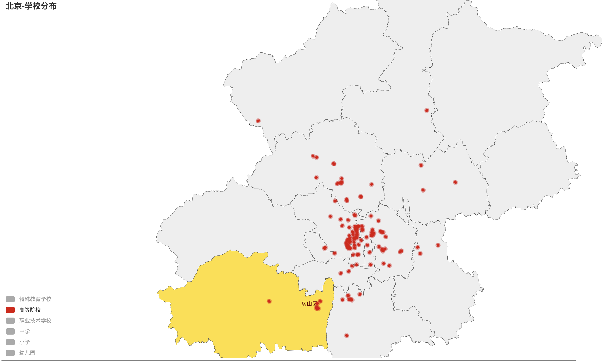

# Pycharm-based location map of schools in Beijing

## Project Overview

The project obtained the public basic information of various schools in Beijing from the website of the Beijing Municipal People's Government, formatted it and stored it in the MySQL database. Part of the data is shown in the figure below, including school's location, area, number of students and teachers, etc.

According to the latitude and longitude of each school, pyecharts, which uses python to draw a chart, marks the location of each school in Beijing on the map of Beijing:

According to the school category, the schools can be viewed separately:

## Files Introduction

* educationalResourceMap.sql: The basic information of each school is stored and needs to be imported into the MySQL database.
* demo_pyecharts.py: Use pyecharts to draw a distribution map of all levels of schools in Beijing.
* beijingDemo.html: Generated map.

