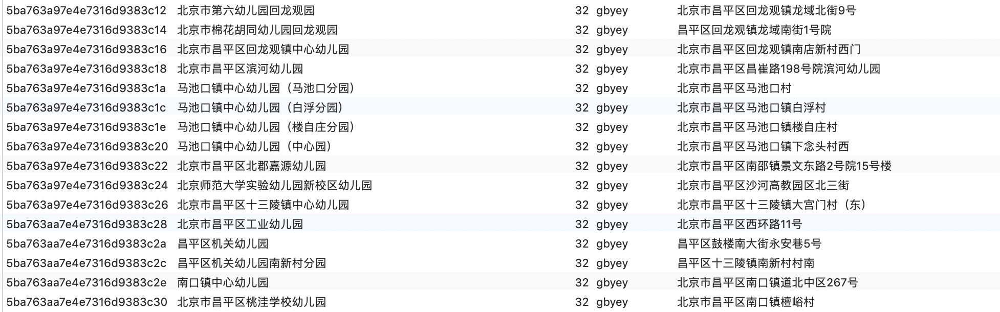
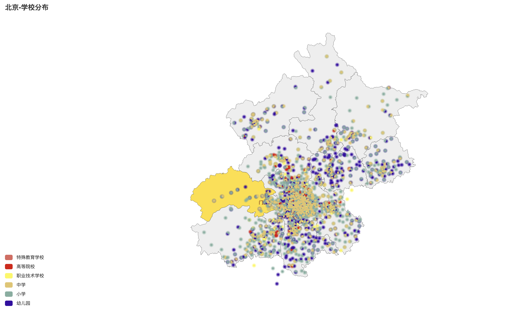

# 基于Pycharm的北京各级学校位置地图

## 项目简介

从北京市人民政府网站爬取到北京各个学校的基本信息，并对其进行格式化处理：

之后根据学校信息的经纬度，利用python绘制图表的pyecharts在北京地图上标注出北京各个学校的所在位置：

可以根据学校类别，对各级学校分别进行查看：

## 文件简介

* educationalResourceMap.sql：存储了各学校的基本信息，需要自行导入MySQL数据库中。
* demo_pyecharts.py：使用pyecharts绘制了北京市各级学校的分布地图。
* beijingDemo.html：生成的地图

